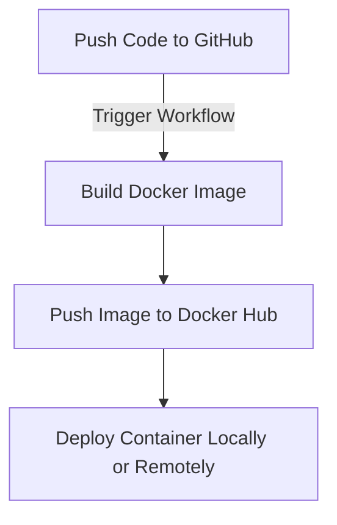

# 2025cloud Project

This project demonstrates the use of Docker and GitHub Actions to automate the build and deployment of a single Docker image, `jmf109u/2025cloud`, which integrates multiple services.

---

## 📂 Repository Structure

```
2025cloud-project/
│
├── app/
│   ├── app.py
│   └── Dockerfile
├── nginx/
│   ├── index.html
│   └── Dockerfile
├── README.md               # This file
└── .github/workflows/docker.yml
```

---

## ⚙️ Prerequisites

* Docker installed locally
* (Optional) Docker Hub account with repository `2025cloud` created and public
* Git installed for version control

---

## 🛠️ Build and Run Instructions

### Build the Docker Image
To build the `jmf109u/2025cloud` image locally, use the following command:
```bash
docker build -t jmf109u/2025cloud:latest .
```

### Run the Docker Image
To run the `jmf109u/2025cloud` image locally, use the following command:
```bash
docker run -d -p 8080:80 jmf109u/2025cloud:latest
```

Access the application at `http://localhost:8080`.

---

## 📦 Push to Docker Hub

```bash
docker login

docker push jmf109u/2025cloud:latest
```

> Make sure your Docker Hub repo `2025cloud` is public to receive the images.

---

## 🏷️ Tag Strategy

We use the following tag strategies for our Docker image:

1. **Semantic Versioning**: Tags like `v1.0.0`, `v1.1.0`, etc., are used for stable releases.
2. **Branch-Based Tags**: Tags like `latest`, `dev`, and `staging` are used for different development stages.

For example:
- `jmf109u/2025cloud:latest` is the latest stable version.
- `jmf109u/2025cloud:dev` is the development version.

---

## 🤖 Automation Workflow

This repository uses GitHub Actions to automate the Docker build and push process. The workflow is defined in [`.github/workflows/docker.yml`](.github/workflows/docker.yml) and performs the following steps:

1. **Checkout Code**: Pulls the latest code from the repository.
2. **Log in to Docker**: Authenticates using secrets (`DOCKER_USERNAME` and `DOCKER_PASSWORD`).
3. **Build and Push Image**:
   - Builds the `jmf109u/2025cloud` image.
   - Pushes the image to Docker Hub.

The workflow triggers on every push to the `main` branch.

---

## 📊 Workflow Overview



---

## 🛠️ Error Simulation for CI

To test the failure detection in GitHub Actions:

1. Create a new branch:
   ```bash
   git checkout -b test-ci-failure
   ```

2. Introduce an error in the `Dockerfile`. For example, change:
   ```dockerfile
   FROM python:3.9-slim
   ```
   to:
   ```dockerfile
   FROM invalid-base-image
   ```

3. Push the branch and create a Pull Request:
   ```bash
   git push origin test-ci-failure
   ```

4. Observe the GitHub Actions workflow fail due to the invalid base image.

---

## 📊 Workflow Overview

```mermaid
graph TD;
    Code[Push Code to GitHub] -->|Trigger Workflow| Build[Build Docker Images];
    Build --> Push[Push Images to Docker Hub];
    Push --> Deploy[Deploy Containers Locally or Remotely];
